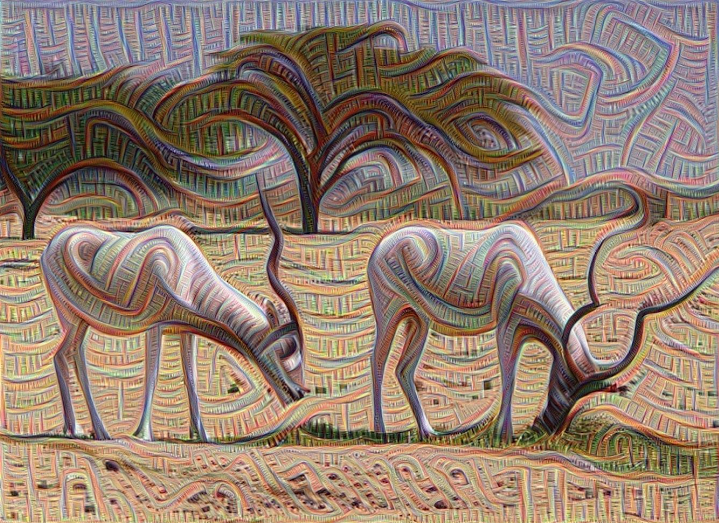

## Installing the Deep Dreaming software stack

In June 2015 Alexander Mordvintsev, Christopher Olah, and Mike Tyka posted some of their deeply engaging "Deep Dreaming" images on [the Google Research Blog](http://googleresearch.blogspot.com/2015/06/inceptionism-going-deeper-into-neural.html).

I was hooked instantly, and when they [published their software](http://googleresearch.blogspot.com/2015/07/deepdream-code-example-for-visualizing.html) a few weeks later, I wanted to give it a try.

The program released by Mordvintsev, Olah, and Tyka is an IPython notebook with about 100 lines of code, available in this [GitHub repository](https://github.com/google/deepdream). However, the program depends on the Caffe neural network framework, which in turn has some other major dependencies, such as the Boost C++ library. Getting all the pieces properly installed and communicating with one another was a bit of a bad deep dream. I tried first on my everyday computer, then tried again on another machine that has a bit less cruft 

### Other guides to installation and troubleshooting

* [Google installation instructions](https://github.com/google/deepdream/blob/master/dream.ipynb)
* [Official Caffe installation page](http://caffe.berkeleyvision.org/installation.html)
* [Official Caffe installation page for OS X](http://caffe.berkeleyvision.org/install_osx.html)
* [Installing Caffe the right way](http://installing-caffe-the-right-way.wikidot.com/start)
* [How to install Caffe on Mac OS X 10.10 for dummies (like me)](http://hoondy.com/2015/04/03/how-to-install-caffe-on-mac-os-x-10-10-for-dummies-like-me/)
* [bobertsdionne Deepdream installation gist](https://gist.github.com/robertsdionne/f58a5fc6e5d1d5d2f798)
* [kylemcdonald Theory of Building Caffe on OS X](https://gist.github.com/kylemcdonald/0698c7749e483cd43a0e)
* [playittodeath How to install Caffe on Mac (OS X Yosemite 10.10.4)](http://playittodeath.ru/how-to-install-caffe-on-mac-os-x-yosemite-10-10-4/)
* [ryankennedy Running deep dream on Windows and OSX](http://ryankennedy.io/running-the-deep-dream/)
* [VISIONAI Deepdreaming in the clouds: A Dockerized deepdream Guide](https://github.com/VISIONAI/clouddream)
* [jcjohnson cnn-vis](https://github.com/jcjohnson/cnn-vis)

Using MacBook Pro 17-inch, late 2011. 2.4 GhZ Core i7, 16GB, AMD Radeon GPU rather than Nvidia, so no hope of running Cuda.

Partition the 750 GB disk, leaving 450 for the current Mavericks partition and 300 for a new blank partition.

From App Store, install OS X Yosemite 10.10.5 (14F27). After reboot onto the new partition, create admin account and fiddle with various preferences.

From App Store download and install Xcode (Version 6.4 (6E35b)). (Possibly the command line tools would have been enough, but I think the full install is needed for the built-in BLAS library.)

Set up Terminal prefs, and confirm that the command-line tools are working (xcode-select -p).

Set Finder prefs for sidebar etc, and do:

	defaults write com.apple.finder AppleShowAllFiles -bool YES
	killall Finder
	
download and install Sublime Text 3

install Homebrew from brew.sh

add link for command-line opening of sublime:

download and set up Mou for Markdown editing (this file)

set up Dropbox

