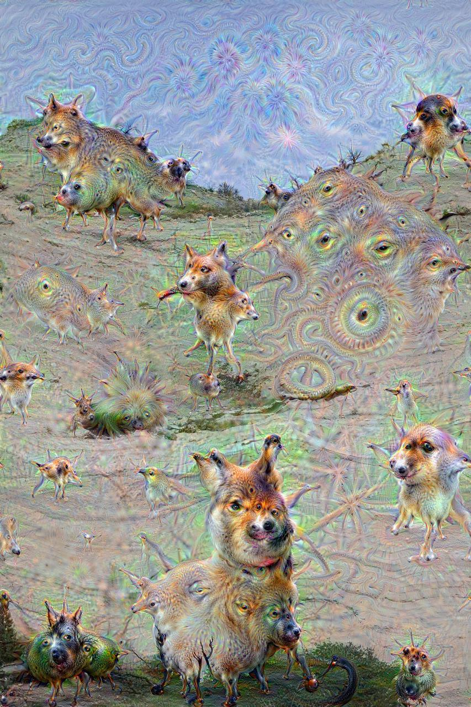

## Installing the Deep Dreaming software stack

In June 2015 Alexander Mordvintsev, Christopher Olah, and Mike Tyka posted some of their fascinating "Deep Dreaming" images on the [Google Research Blog](http://googleresearch.blogspot.com/2015/06/inceptionism-going-deeper-into-neural.html). I was pretty amazed, and when they [published their program](http://googleresearch.blogspot.com/2015/07/deepdream-code-example-for-visualizing.html) a few weeks later, I knew I would have to give it a try. I've now got the software running, and so I can make weird-and-wonderful pictures like this:

But it wasn't easy getting here. The program released by Mordvintsev, Olah, and Tyka is an IPython notebook with about 100 lines of code, available in this [GitHub repository](https://github.com/google/deepdream). No problem there. However, the program depends on the Caffe neural network framework, which in turn has some other major dependencies, such as the Boost C++ library and the opencv library for computer vision. Getting all the pieces properly installed and communicating with one another was a bit of a *bad* deep dream. I made several attempts to get it running on my everyday computer, then switched to a different machine that had a little less cruft in its dark corners. That also failed. Annoyed and chagrined, I decided to try again on a completely fresh disk partition, with a newly installed operating system. Success at last.

This memo documents the steps I followed in the final successful install. Note that the file paths given below are are all relative to my own home directory; obviously you need to substitute your own.

### Other guides to installation and troubleshooting

* [Google installation instructions](https://github.com/google/deepdream/blob/master/dream.ipynb)
* [Official Caffe installation page](http://caffe.berkeleyvision.org/installation.html)
* [Official Caffe installation page for OS X](http://caffe.berkeleyvision.org/install_osx.html)
* [Installing Caffe the right way](http://installing-caffe-the-right-way.wikidot.com/start)
* [How to install Caffe on Mac OS X 10.10 for dummies (like me)](http://hoondy.com/2015/04/03/how-to-install-caffe-on-mac-os-x-10-10-for-dummies-like-me/)
* [bobertsdionne Deepdream installation gist](https://gist.github.com/robertsdionne/f58a5fc6e5d1d5d2f798)
* [kylemcdonald Theory of Building Caffe on OS X](https://gist.github.com/kylemcdonald/0698c7749e483cd43a0e)
* [playittodeath How to install Caffe on Mac (OS X Yosemite 10.10.4)](http://playittodeath.ru/how-to-install-caffe-on-mac-os-x-yosemite-10-10-4/)
* [ryankennedy Running deep dream on Windows and OSX](http://ryankennedy.io/running-the-deep-dream/)
* [VISIONAI Deepdreaming in the clouds: A Dockerized deepdream Guide](https://github.com/VISIONAI/clouddream)
* [jcjohnson cnn-vis](https://github.com/jcjohnson/cnn-vis)

### Hardware environment

Apple MacBook Pro 17-inch, late 2011. 2.4 GhZ Core i7, 16GB RAM. The GPU is an AMD Radeon rather than an Nvidia part, so there's no hope of running Cuda, and I did not install the Cuda interface for Caffe.

New, empty 300 GB partition on a 750 GB disk.

### Set up the software environment

From the App Store, install OS X Yosemite 10.10.5 (14F27). After reboot onto the new partition, create admin account.

From the App Store download and install Xcode (Version 6.4 (6E35b)).

Install [Homebrew](http://brew.sh/) (the package manager with all the silly beer metaphors):

    folio:~ bph$ ruby -e "$(curl -fsSL https://raw.githubusercontent.com/Homebrew/install/master/install)"

Set the PATH so we can find executables in usr/local/bin:

    folio:~ bph$ export PATH=/usr/local/bin:/usr/bin:/usr/sbin:/bin:/sbin:
    
Make sure Homebrew is working:

    folio:~ bph$ brew doctor

(I got a warning about an outdated XQuartz, which I ignored.)

For some of the steps below you'll need access to a text editor. I dislike editing within a terminal session, so I installed [Sublime Text](http://www.sublimetext.com/3) and added a symlink so I can open it from the command line:

    folio:~ bph$ ln -s "/Applications/Sublime Text.app/Contents/SharedSupport/bin/subl" /usr/local/bin/sublime

Install Python 2.7 and pip via Homebrew:

    folio:~ bph$ brew install python pip

Homebrew automatically installs several dependencies: pkg-config, readline, sqlite, gdbm, openssl, then Python 2.7.10_2 and the pip utility for managing more Python packages.

Note that OS X comes with a preinstalled Python. As a matter of fact, it has four of them, versions 2.3 through 2.7. And I ordinarily use a different Python distribution, from Anaconda. But I believe most of the trouble I was having could be traced back to stray linkages to packages from the wrong Python version. Seemed safest and simplest for this experiment to run the Homebrew install.

### Install Caffe and its dependencies

Now we're ready to get Caffe going. Following the [installation instructions](http://caffe.berkeleyvision.org/install_osx.html), we start with some dependencies:

    folio:~ bph$ brew install -vd snappy leveldb gflags glog szip lmdb
    
(Snappy is a compression library; LevelDB is a key-value store; Gflags is a utility for setting command-line flags; glog is a logging facility; szip does lossless compression of HDF5 files; lmdb (the Lightning Memory-Mapped Database) is another key-value store. Why do we need two key-value databases? I'm sure there's a perfectly good reason.)

    folio:~ bph$ brew tap homebrew/science

[Homebrew/science](https://github.com/Homebrew/homebrew-science/blob/master/opencv.rb) is a repository of Homebrew install scripts for about 500 packages of interest in scientific computing. This command downloads the scripts, making the packages available for installation. Below we'll be installing two of them, hdf5 and opencv.

    folio:~ bph$ brew install hdf5
    
[HDF (Hierarchical Data Format)](https://www.hdfgroup.org/HDF5/) is a library and file format for large and complex data sets.

    folio:~ bph$ brew install opencv

"[OpenCV](http://opencv.org/about.html) (Open Source Computer Vision Library) is an open source computer vision and machine learning software library." It's large and complex, and it has dependencies that are also large and complex. One of those dependencies is a patched version of gcc, the Gnu C compiler, which has to be compiled from source; that takes about an hour.

    folio:~ bph$ brew install --build-from-source -vd protobuf

"[Protocol buffers](https://developers.google.com/protocol-buffers/?hl=en) are Google's language-neutral, platform-neutral, extensible mechanism for serializing structured data — think XML, but smaller, faster, and simpler."

As the command indicates, this is another compile-from-source project. The '-vd' options request verbose output and debugging information, and verbose it is: The command will spew 2,200 lines of log entries into the terminal window, most of them having to do with localization. I'm relieved to know I've got zoneinfo set for any of the 12 places in Antarctica I might be visiting.

